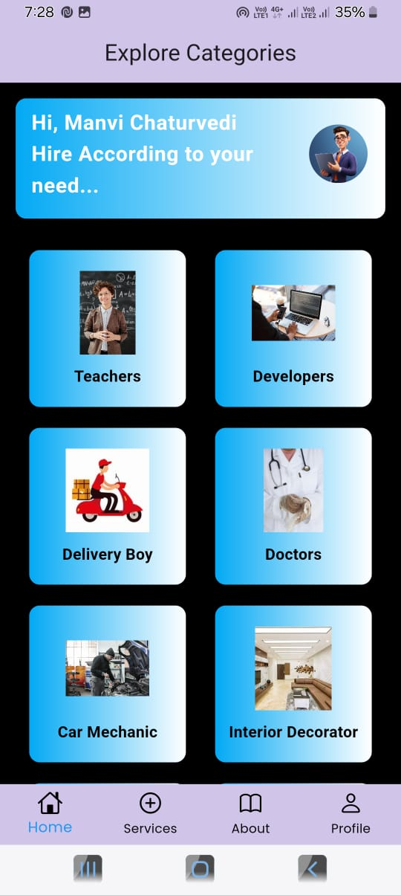
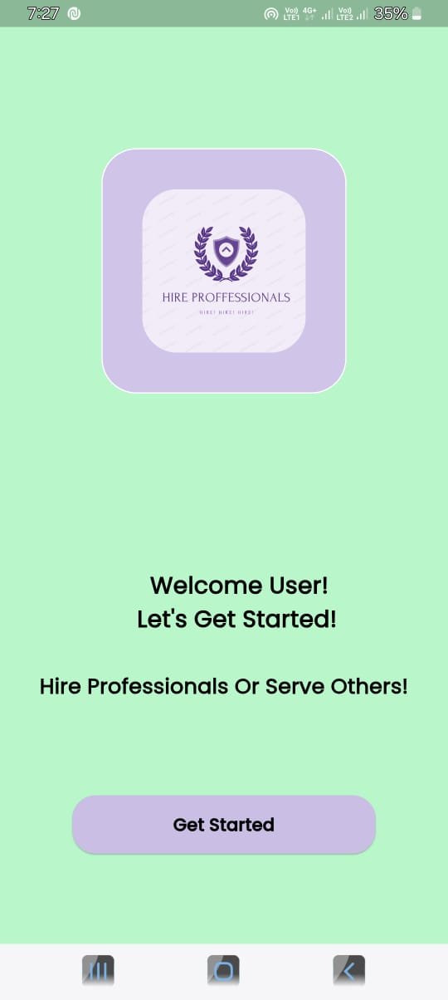
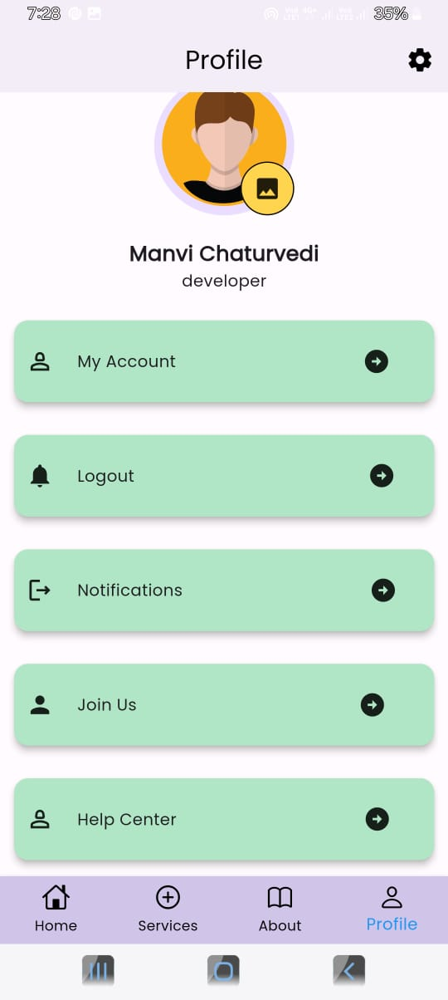
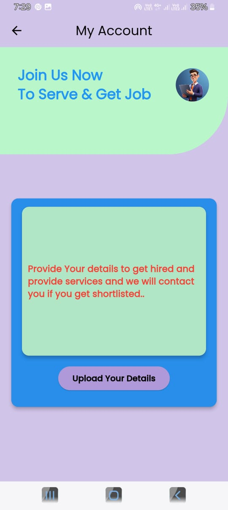
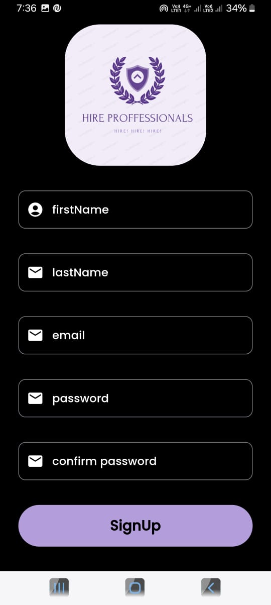

# 🔧 Hire_Proff_Home&_Service_providing– Hire & Offer Services Seamlessly

**ProConnect** is a cross-platform mobile application built with **Flutter** and powered by **Firebase**. It connects users who are looking to **hire professionals** with those who **offer services** — all in one intuitive and secure platform.

From hiring electricians, designers, developers, or tutors — to offering your professional skills as a service provider — **ProConnect** makes it quick, reliable, and hassle-free.

---

## 📱 App Features

### 👥 Dual Roles – User & Service Provider
- Switch between hiring and offering services
- Separate dashboards and functionalities

### 🔍 Smart Search & Filters
- Search professionals by skill, rating, location, or price
- Instant results with real-time updates

### 🧑‍💼 Service Provider Profiles
- Show off your skills, portfolio, ratings, and reviews

### 📅 Booking & Scheduling
- Send requests
- Schedule jobs with time and date

### ⭐ Ratings & Reviews
- Leave feedback after completed services
- Build trust and credibility

### Beautiful ui implementation
- using flutter (dart)

---

## 🔧 Built With

| Tech           | Description                     |
|----------------|---------------------------------|
| 🐦 Flutter      | Frontend for Android & iOS      |
| 🔥 Firebase     | Backend services (Auth, Firestore, Storage, Messaging) |

## 📸 Screenshots

> ScreenShots Of UI
)  
)

> 
> > 
> 
> > )  

---

## 📦 Installation & Setup

### 1. Clone the Repository

```bash
git clone https://github.com/your-username/proconnect-app.git
cd proconnect-app
